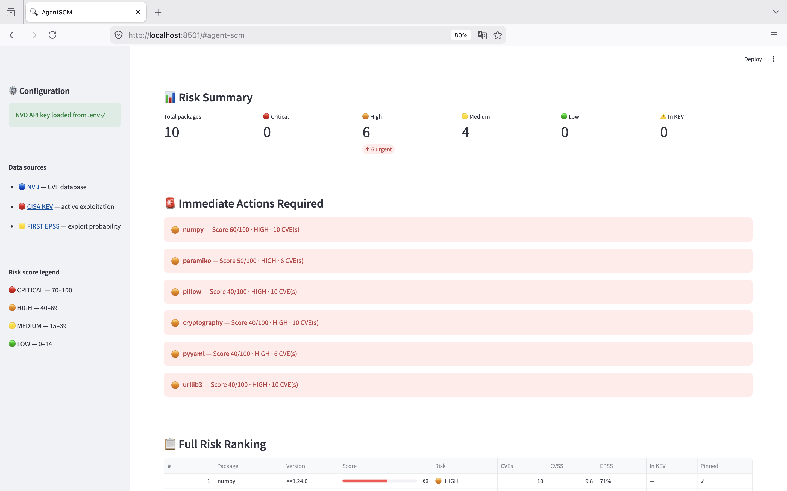

# AgentSCM 🔍


An agentic open-source dependency threat detection platform that analyzes your Python project's dependencies, correlates them with live vulnerability intelligence, and prioritizes the ones that need immediate action.

## What it does

- Parses your `requirements.txt` into a clean package inventory
- Enriches each package with CVE data (NVD), active exploitation status (CISA KEV), and exploit likelihood (EPSS)
- Scores risk using severity + exploitation context + dependency signals
- Generates analyst-ready findings with remediation recommendations
- Displays results in an interactive dashboard

## Why it matters

Most vulnerability scanners dump every CVE and leave us to figure out what matters. This tool prioritizes a CVE that's being actively exploited and has a 90% EPSS score is not the same as a theoretical low-severity issue from 3 years ago.

## Dashboard


 
## Tech stack

- Python 3.11+
- NVD API (CVE data)
- CISA KEV (active exploitation watchlist)
- FIRST EPSS API (exploit probability scoring)
- Streamlit (dashboard)


## Project structure

```
AgentSCM/
├── src/
│   ├── parser.py        # Stage 1: Parse requirements.txt
│   ├── enricher.py      # Stage 2: Fetch CVE/KEV/EPSS data
│   ├── scorer.py        # Stage 3: Risk scoring and ranking
│   ├── pipeline.py      # Stage 4: Wires all stages, main entry point
│   ├── dashboard.py     # Stage 5: Streamlit dashboard
│   └── remediation.py   # Stage 6: PyPI latest version + remediation suggestions 
├── data/
│   └── samples/         # Sample requirements files for testing
├── tests/
├── .env                 # Your API keys — never committed
└── requirements.txt
```

## Risk scoring

Each package is scored 0–100 based on four signals:

| Signal | Points |
|---|---|
| Critical CVE (CVSS 9–10) | 40 |
| High CVE (CVSS 7–8.9) | 25 |
| Medium CVE (CVSS 4–6.9) | 10 |
| In CISA KEV (actively exploited) | +30 |
| High EPSS >70% | +20 |
| Moderate EPSS 40–70% | +10 |
| Version not pinned | +5 |

Scores map to: 🔴 CRITICAL (70+) · 🟠 HIGH (40–69) · 🟡 MEDIUM (15–39) · 🟢 LOW (0–14)

## Setup

```bash
git clone https://github.com/1n51d10u5-ip/AgentSCM
cd AgentSCM
pip install -r requirements.txt #To install this program's dependencies

```

Create a `.env` file in the project root:
```
NVD_API_KEY=your-key-here
```

Get a free NVD API key at: https://nvd.nist.gov/developers/request-an-api-key

Add the '.env' to '.gitignore'

## Usage
 
Run the full pipeline on any `requirements.txt`:
 
```bash
python src/pipeline.py data/samples/requirements.txt
python src/pipeline.py /path/to/your/project/requirements.txt
```
 
Results are printed to terminal and saved to `data/results.json`.

Or launch the interactive dashboard:
 
```bash
streamlit run src/dashboard.py
```
 
Then open http://localhost:8501 in your browser. Upload any `requirements.txt` or click "Run with sample file" to see a demo.

## Sample output
 
```
  AgentSCM — Risk Score Report
  ────────────────────────────────────────────────────────────
  #    PACKAGE                   SCORE    LABEL      CVEs
  ---- ------------------------- -------- ---------- ----
  1    pillow (==9.0.0)          90       🔴 CRITICAL  3
  2    requests (==2.28.1)       35       🟡 MEDIUM    1
  3    django (==3.2.0)          10       🟢 LOW       2
  4    numpy (unpinned)           5       🟢 LOW       0
 
  AgentSCM — Recommended Actions
  ────────────────────────────────────────────────────────────
  🔴 CRITICAL — Patch or mitigate immediately
     • pillow
 
  🟡 MEDIUM — Review and plan remediation
     • requests
 
  🟢 LOW — Monitor, no immediate action
     • django
     • numpy
```

---

Built as a project demonstrating supply-chain security analysis, threat intelligence enrichment, and detection engineering principles.


## Feature Roadmap 
 
### 🔵 Must have
| Feature | Reason |
|---|---|
| Streamlit dashboard | ✅ Done |
| Remediation suggestions per package | ✅ Done |
| Exportable JSON report | ✅ Done |
| GitHub Actions CI integration | ✅ Done |
 
### 🟢 Should have (next version)
| Feature | Reason |
|---|---|
| npm / package-lock.json support | Expands beyond Python, making it ecosystem-agnostic |
| `poetry.lock` support | Most modern Python projects support |
| Dependency graph view | Visualize direct vs transitive risk paths |
| CycloneDX SBOM input | Formal SBOM support for enterprise and DevSecOps credibility |
 
### 🟡 Could have (next version)
| Feature | Reason |
|---|---|
| Fresh exploit signal ingestion | Paste a CVE or advisory and checks if packages are affected |
| LLM-generated analyst brief | Natural language summary of top risks and recommended actions |
| Package maintainer health signals | Last release date with contributor count and staleness risk |
| Typosquatting detection | Flag packages with names suspiciously similar to popular libraries |
| Live Twitter/X scraping | Brittle and API-restricted; manual signal input covers the concept cleanly |
| Dependency graph view | Visualize direct vs transitive risk paths |
| CycloneDX SBOM input | Formal SBOM support for enterprise and DevSecOps credibility |

### ⚫ Won't have
| Feature | Reason |
|---|---|
| ML-based scoring | Rule-based is explainable and sufficient; ML adds complexity without value here |
| Auto-patching / PR creation | A step out into remediation automation |
| Multi-tenant / SaaS mode | In case someday envision this as product |